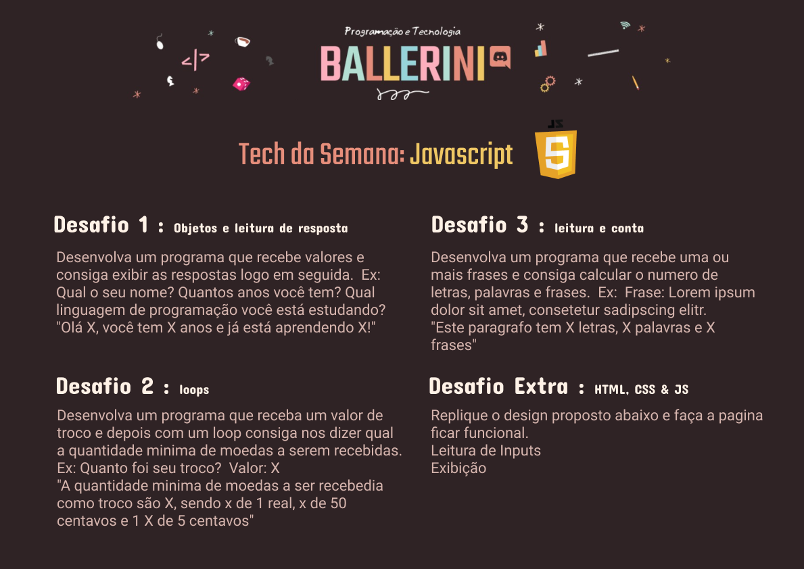

# Desafio_Ballerini
##Não possui nenhuma dependência para instalação.##

Desafio proposto na comunidade Ballerini do discord.

Modelo no Figma:
<https://www.figma.com/file/nPRQtJqmENcS9eO46IwJo8/DesafioJS---Comunidade-Ballerini?node-id=7%3A46>

Juntei o desafio Extra para criação de todas ás páginas usando HTML 5 e CSS 3. Também busquei aplicar o conceito de MVC (Model,View,Controll) e o paradigma de orientação a objetos no JavaScript.

Para retornar a HOME, basta clicar no logo no topo da página.

Página Home:

 

 

 
